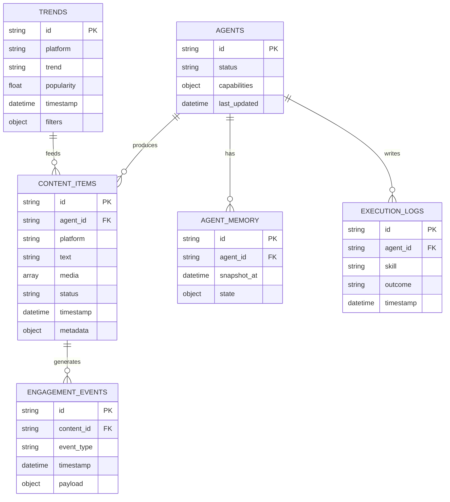

# Project Chimera: Technical Specification

**Status:** Ratified  
**Purpose:** Executable intent for agents — API contracts (JSON in/out), database schema (ERD for video/content metadata), and skill interfaces. Aligned with SRS and Hierarchical Swarm (Planner–Worker–Judge).

---

## 1. API Contracts

All request/response bodies are JSON. Agents and skills MUST conform to these shapes. All external actions (social publish, trend fetch) are intended to be executed via MCP Tools; these contracts define the payloads those tools consume and produce.

---

### 1.1 Agent Task (Planner → Worker)

Used by the Orchestrator/Planner to push work to the Task Queue. Workers pop tasks and return results to the Judge.

**Task payload (JSON):**

```json
{
  "task_id": "uuid-v4-string",
  "task_type": "generate_content | reply_comment | fetch_trends | execute_publish",
  "priority": "high | medium | low",
  "context": {
    "goal_description": "string",
    "persona_constraints": ["string"],
    "required_resources": ["mcp://twitter/mentions/123", "mcp://memory/recent"]
  },
  "assigned_worker_id": "string",
  "created_at": "timestamp",
  "status": "pending | in_progress | review | complete"
}
```

| Field | Type | Required | Description |
|-------|------|----------|-------------|
| `task_id` | string (UUID) | Yes | Unique task identifier |
| `task_type` | string | Yes | One of: generate_content, reply_comment, fetch_trends, execute_publish (extensible) |
| `priority` | string | No | high, medium, low |
| `context` | object | No | goal_description, persona_constraints, required_resources (MCP URIs) |
| `assigned_worker_id` | string | No | Worker node id when assigned |
| `created_at` | string (ISO 8601) | Yes | Creation timestamp |
| `status` | string | Yes | pending, in_progress, review, complete |

---

### 1.2 Trend Fetching API

**Endpoint:** `GET /api/trends` (or equivalent MCP Tool / skill input)

**Request (query or body):**

```json
{
  "platform": "twitter",
  "filters": {
    "hashtags": ["#AI", "#Tech"],
    "keywords": ["machine learning"],
    "time_range": "last_24_hours"
  }
}
```

| Field | Type | Required | Description |
|-------|------|----------|-------------|
| `platform` | string | Yes | One of: `twitter`, `instagram`, `tiktok` (extensible) |
| `filters` | object | No | Optional filters |
| `filters.hashtags` | string[] | No | List of hashtags |
| `filters.keywords` | string[] | No | Keywords |
| `filters.time_range` | string | No | e.g. `last_24_hours`, `last_7_days` |

**Response (200):**

```json
{
  "status": "success",
  "data": [
    {
      "trend": "AI in 2026",
      "popularity": 95,
      "platform": "twitter",
      "timestamp": "2026-02-05T12:00:00Z"
    }
  ]
}
```

**Response (4xx/5xx error):**

```json
{
  "status": "error",
  "code": "UNSUPPORTED_PLATFORM",
  "message": "Platform 'xyz' is not supported."
}
```

---

### 1.3 Content Generation (Agent/Skill Contract)

**Input (to content generator skill or internal API):**

```json
{
  "trends": [
    { "trend": "AI in 2026", "popularity": 95 }
  ],
  "platform": "instagram",
  "policy": {
    "max_length": 2200,
    "require_hashtags": true,
    "sensitive_topics": []
  }
}
```

**Output (draft content):**

```json
{
  "status": "success",
  "draft": {
    "text": "Check out the latest in AI! #AI #Tech",
    "media": ["image1.jpg", "video1.mp4"],
    "platform": "instagram",
    "risk_score": 0.1,
    "confidence_score": 0.92
  }
}
```

- `risk_score` (0.0–1.0): Used for HITL routing; above threshold → human review.
- `confidence_score` (0.0–1.0): LLM-derived confidence; Judge uses for auto-approve / async approval / reject per SRS NFR 1.1.

If `risk_score` or `confidence_score` exceeds configured thresholds, the system MUST route the draft to human-in-the-loop.

---

### 1.4 Content Publishing API

**Endpoint:** `POST /api/publish` (or MCP Tool e.g. `post_content`)

**Request:**

```json
{
  "platform": "instagram",
  "content": {
    "text": "Check out the latest in AI!",
    "media": ["image1.jpg", "video1.mp4"]
  },
  "idempotency_key": "optional-uuid",
  "disclosure_level": "automated | assisted | none"
}
```

**Response (200):**

```json
{
  "status": "success",
  "message": "Content published successfully.",
  "external_id": "platform-specific-id"
}
```

**Response (error):**

```json
{
  "status": "error",
  "code": "PUBLISH_FAILED",
  "message": "Platform API returned 429 Too Many Requests."
}
```

---

### 1.5 Status API (OpenClaw / internal)

**Endpoint:** `POST /api/status`

**Request:**

```json
{
  "agent_id": "chimera_001",
  "status": "active",
  "last_updated": "2026-02-05T12:00:00Z",
  "capabilities": ["trend_fetch", "content_generate", "publish"],
  "platforms": ["instagram", "tiktok"],
  "availability_window": { "start": "2026-02-05T09:00:00Z", "end": "2026-02-05T17:00:00Z" }
}
```

**Response (200):**

```json
{
  "status": "success",
  "message": "Status updated."
}
```

---

## 2. Database Schema (ERD for Video & Content Metadata)

Storage is **NoSQL-oriented** (high write velocity, flexible schemas, time-series, horizontal scalability). The logical model below defines the **shape** of entities for video/content metadata, trends, agents, and events.

### 2.1 Entity-Relationship Diagram (Mermaid)



### 2.2 Table / Collection Definitions

| Entity | Purpose | Key fields |
|--------|---------|------------|
| **TRENDS** | Cached or ingested trend data | `id`, `platform`, `trend`, `popularity`, `timestamp`, `filters` |
| **CONTENT_ITEMS** | Video/post metadata and status | `id`, `agent_id`, `platform`, `text`, `media[]`, `status`, `timestamp`, `metadata` |
| **ENGAGEMENT_EVENTS** | Likes, shares, comments (time-series) | `id`, `content_id`, `event_type`, `timestamp`, `payload` |
| **AGENTS** | Agent registry and status (network node) | `id`, `status`, `capabilities`, `last_updated` |
| **AGENT_MEMORY** | Snapshots of agent state (evolving schema) | `id`, `agent_id`, `snapshot_at`, `state` |
| **EXECUTION_LOGS** | Skill runs and outcomes | `id`, `agent_id`, `skill`, `outcome`, `timestamp` |

---

## 3. Skill Interfaces (Input/Output Contracts)

Skills in `skills/` MUST accept and return structures that align with the API contracts above. All external capabilities (trends, publish) are exposed to agents via MCP Tools or internal skills that conform to these contracts. Tests in `tests/` MUST assert these contracts.

| Skill | Input (summary) | Output (summary) |
|-------|-----------------|------------------|
| `skill_trend_fetcher` | `{ platform, filters? }` | `{ status, data: [ { trend, popularity, platform, timestamp } ] }` |
| `skill_content_generator` | `{ trends, platform, policy }` | `{ status, draft: { text, media, platform, risk_score, confidence_score? } }` |
| `skill_publish` | `{ platform, content, idempotency_key?, disclosure_level? }` | `{ status, message?, external_id? }` or error |

Implementation details are left to the implementation phase; contracts are fixed by this spec.
